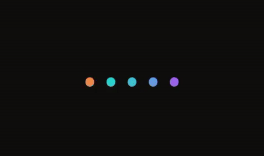
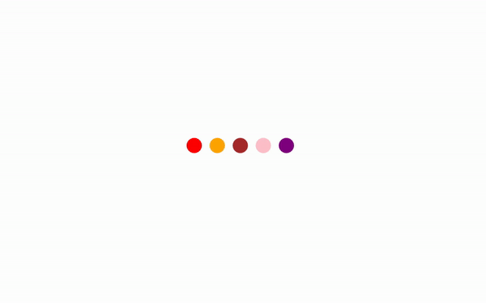

# AudioWaveAnimation
This repo contains QML implementation of a audio wave gif. Its meant for learning QML workings or event using it for your projects. You can watch the full coding process on youtube below:

## Original GIF

## Current Animation

# Have Any Questions? 
Check my blog [here](https://www.codeart.co.ke) which goes into details on the implementation logic. You can leave your message there or on the youtube video above. Enjoy!
